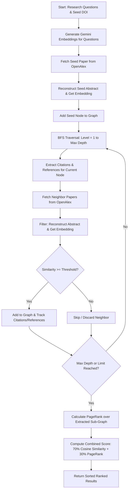

# AI Developer Handbook & Architecture Guide

This document is designed for AI coding assistants, Copilot agents, and developers to instantly understand the structure, architecture, design patterns, coding standards, and algorithmic processes of the **ALRS GraphSelect API**.

---

## 🗺️ Project Blueprint & Directory Structure

The project is structured logically to separate concerns between route handling, models, core service wrappers, and the core search algorithm.

```
newcode/
├── .github/
│   ├── workflows/
│   │   ├── ci.yml               # Runs pytest on pushes and pull requests
│   │   ├── docker-publish.yml   # Builds/pushes Docker images to GHCR on v* tags
│   │   └── release.yml          # Triggers GitHub Releases on v* tags
│   ├── PULL_REQUEST_TEMPLATE.md
│   └── FUNDING.yml
├── code/                        # Main Python project source
│   ├── models/                  # Pydantic data schemas
│   │   ├── __init__.py          # Exports all models
│   │   ├── openalex_models.py   # Work, Author, Authorship, Response schemas
│   │   ├── graph_node.py        # GraphNode (citation network node representation)
│   │   ├── progress.py          # State/Progress tracking for searches
│   │   └── ranked_paper.py      # Final output ranking structure
│   ├── services/                # External APIs & internal business logic
│   │   ├── __init__.py
│   │   ├── gemini_service.py    # Google GenAI Embeddings client
│   │   ├── openalex_service.py  # Async OpenAlex API client
│   │   ├── opencitations_service.py # Async OpenCitations API client
│   │   └── graph_search_service.py  # CORE GraphSelect Algorithm
│   ├── routers/
│   │   ├── __init__.py
│   │   └── search.py            # API Route handlers (/search, /search/stream)
│   ├── static/                  # Single Page Application frontend
│   │   └── index.html           # Embedded modern Tailwind UI test bench
│   ├── tests/                   # Pytest suite
│   │   ├── conftest.py          # Mocks & fixtures for tests
│   │   ├── test_algorithm.py    # Tests core traversal logic
│   │   ├── test_api.py          # Tests FastAPI endpoints
│   │   ├── test_models.py       # Tests Pydantic parsing
│   │   └── ...
│   ├── main.py                  # FastAPI Application Startup & Configuration
│   ├── config.py                # pydantic-settings config registry
│   ├── VERSION                  # Project single source of truth for versioning
│   ├── Dockerfile               # Multi-stage non-root container configuration
│   ├── docker-compose.yml       # Orchestrates app deployment
│   ├── run_graphselect.sh       # Linux/macOS docker setup bootstrap script
│   └── run_graphselect.bat      # Windows docker setup bootstrap script
├── bump_version.py              # CLI tool for unified version bumping
├── LICENSE                      # MIT License
├── CONTRIBUTING.md              # Open-source contribution guidelines
└── SECURITY.md                  # Security vulnerability report procedures
```

---

## ⚙️ Core Architecture & Tech Stack

The application is built on top of high-performance modern Python technologies:

1. **FastAPI**: Handles high-performance ASGI-compliant request routing and Server-Sent Events (SSE).
2. **Pydantic v2**: Handles all JSON serialization, parsing, and type-safe validation.
3. **httpx**: Handles all asynchronous HTTP communication to downstream APIs (OpenAlex/OpenCitations) with high-efficiency async connections.
4. **google-genai SDK**: Accesses Google's Gemini embeddings API.
5. **pydantic-settings**: Reads system configuration dynamically from environment variables or a local `.env` file.
6. **Docker / Docker Compose**: Provides lightweight containerized deployments running as a non-privileged `appuser`.

---

## 🧠 The GraphSelect Algorithm

GraphSelect is a semantic-driven paper discovery and ranking algorithm designed to find relevant academic works using a small seed set and research questions.

### Execution Flow


### Algorithmic Equations & Scoring Rules

#### 1. Cosine Similarity
Determines the semantic similarity between an abstract embedding $\vec{a}$ and a research question embedding $\vec{q}$:
$$\text{Sim}(\vec{a}, \vec{q}) = \frac{\vec{a} \cdot \vec{q}}{\|\vec{a}\| \|\vec{q}\|}$$
A paper is **relevant** if its maximum similarity score across all research questions exceeds the threshold:
$$\max_{q} \left( \text{Sim}(\vec{a}, \vec{q}) \right) \ge \text{similarity\_threshold} \quad (\text{default: } 0.3)$$

#### 2. PageRank Score
Calculates network-based centrality on the discovered subgraph $G = (V, E)$ where nodes represent relevant papers, and edges are citations and references. Iterative calculation runs for $k$ iterations (default: 20, damping $\alpha = 0.85$):
$$PR(u) = \frac{1 - \alpha}{|V|} + \alpha \sum_{v \in B_u} \frac{PR(v)}{L(v)}$$
*Where $B_u$ is the set of nodes referencing/citing $u$, and $L(v)$ is the total outgoing/incoming link degree of $v$.*

#### 3. Combined Score
Balances local semantic relevance with global network significance:
$$\text{Score}(u) = w_{\text{sim}} \cdot \max_{q}\left(\text{Sim}(u, q)\right) + w_{pr} \cdot \frac{PR(u)}{\max(PR)}$$
*Defaults: $w_{\text{sim}} = 0.7$, $w_{pr} = 0.3$.*

---

## 🎨 Coding Conventions & AI Guidelines

When editing or extending this codebase, adhere strictly to these patterns:

### 1. Unified Configuration Patterns
Always retrieve settings through dependency injection or the `get_settings()` provider in `code/config.py`.
```python
# 🚫 AVOID importing Settings directly and instantiating it:
# from config import Settings
# settings = Settings()

# ✅ ALWAYS use get_settings():
from config import get_settings
settings = get_settings()
print(settings.gemini_api_key)
```

### 2. Type Hints & Code Documentation
- All functions must declare return types and parameter types (`PEP 484`).
- Use Google-style docstrings.
- Place module docstrings explaining the purpose of each new file.

### 3. Error Handling and Logging
- Never use print statements for debugging or operational logs. Always use the standard `logging` module.
- In async HTTP tasks, wrap request calls in `try...except` and log high-fidelity exceptions using `logger.error("Message", exc_info=True)` or `logger.warning`.

### 4. Single Source of Truth for Versioning
- Versioning is strictly stored in `code/VERSION` as a plain string (e.g., `2.3.2-beta`).
- Never edit version strings manually in `main.py`, `Dockerfile`, or workflows.
- Always use `bump_version.py` from the root folder:
  ```bash
  python bump_version.py 2.4.0
  ```

### 5. Async Httpx Client Management
Always close custom `httpx.AsyncClient` instances when destroying or finishing a service workflow. Hook them to FastAPI's cleanup events or handle them in the service lifecycle:
```python
async def close(self) -> None:
    """Close the HTTP client."""
    await self._client.aclose()
```

### 6. Gemini Embeddings Configuration Guidelines
- Currently uses `gemini-embedding-001`.
- If migrating to `gemini-embedding-2`, remember:
  - `task_type` is **not** supported on `gemini-embedding-2`.
  - Prefix inputs:
    - Queries: `"task: search result | query: {query}"`
    - Documents: `"title: {title} | text: {content}"` (use `"title: none"` if no title exists).
  - Truncated dimensions on `gemini-embedding-2` are automatically normalized, whereas `gemini-embedding-001` requires manual L2 normalization if dimension is non-3072.

---

## 🧪 Testing Patterns

We use `pytest` and `pytest-asyncio` for unit tests and integration tests.

### Mocking Guidelines
Mocks are provided in `code/tests/conftest.py`. When writing tests for features interacting with external APIs, always mock:
1. `GeminiService.get_embedding` (returns deterministic float lists).
2. `OpenAlexService` calls (`get_work`, `get_citations`, `get_references`).

To run the full suite:
```bash
pytest tests/ -v
```

---

## 🚀 SSE (Server-Sent Events) Implementation

For real-time streaming search updates, `routers/search.py` implements a streaming endpoint `/api/search/stream` utilizing an `asyncio.Queue` bridge.

```python
@router.post('/search/stream')
async def run_search_stream(request: SearchRequest) -> StreamingResponse:
    # 1. build service and an async queue
    service, queue = _build_service(request)
    # 2. execute the search as an async background task
    asyncio.create_task(_run_search_and_signal(service, queue))
    # 3. stream queue items formatted as SSE frames
    return StreamingResponse(
        content=_sse_generator(queue),
        media_type='text/event-stream'
    )
```

Event frames emitted include:
- `progress`: High-level search status (`GraphSearchProgress`).
- `paper_processing`: Triggered when starting a work's analysis.
- `paper_found`: Triggered when a paper is successfully qualified and added to the graph.
- `paper_skipped`: Triggered when skipped due to missing abstract or similarity scoring below threshold.
- `results`: The final ranked `SearchResponse`.
- `error`: Error metadata.

---

This blueprint details the design guidelines of **ALRS GraphSelect API**. Keep it updated whenever structural, algorithmic, or operational modifications are introduced!
