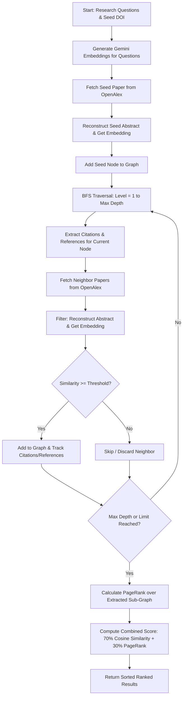

# GraphSelect: Embedding-Guided Graph Traversal for Scalable Semantic Paper Search

[](./code/VERSION)
[](https://doi.org/10.1109/SRC65875.2025.11263707)
[](https://www.python.org/)
[](https://fastapi.tiangolo.com/)
[](https://www.docker.com/)
[](./LICENSE)

Welcome to the official, production-grade implementation of the **GraphSelect** search algorithm. Designed for modern academic exploration, **GraphSelect** combines high-dimensional text embeddings with selective, thresholded citation graph traversal. This approach achieves semantic retrieval accuracy comparable to massive vector databases—without the associated high computational costs, partitioning challenges, and re-indexing overheads.

This repository serves as the reference implementation of our peer-reviewed paper:
> **GraphSelect: Embedding-Guided Graph Traversal for Scalable Semantic Paper Search**  
> *Published in the Proceedings of the 2025 16th Student Research Conference on Applied Computing (SRC 2025)*  
> **DOI:** [10.1109/SRC65875.2025.11263707](https://doi.org/10.1109/SRC65875.2025.11263707)

---

## 📖 About the Paper & Core Methodology

Conducting thorough literature reviews is a foundational, yet highly time-consuming, aspect of research. Conventional keyword-based search systems struggle with semantic intent, while pure vector databases suffer from scalability limits, high re-indexing costs, and a lack of relational context. 

**GraphSelect** addresses these issues by marrying **semantic embeddings** with **graph-based citation networks**. Instead of searching globally across a massive vector index, GraphSelect embeds the researcher's query and paper abstracts, computes local semantic similarities, and expands the citation network dynamically only through papers that clear defined relevance thresholds.



### Algorithmic Equations & Scoring Rules

#### 1. Semantic Embedding & Cosine Similarity
We encode research queries and paper abstracts using a high-capacity model (e.g., `text-embedding-3-large`). The semantic similarity between an abstract embedding $\vec{v}_{\text{node}}$ and a research question embedding $\vec{v}_{\text{question}_i}$ is computed via Cosine Similarity:

$$\text{Score}(\text{node}, \text{question}_i) = \frac{\vec{v}_{\text{node}} \cdot \vec{v}_{\text{question}_i}}{\|\vec{v}_{\text{node}}\| \cdot \|\vec{v}_{\text{question}_i}\|}$$

A candidate paper is determined to be **relevant** if its similarity score exceeds the predefined threshold for *any* of the research questions (logical OR):

$$\text{isRelevant}(\text{node}, V, T) = \bigvee_{i=1}^{n} \left(\text{Score}(\text{node}, \vec{v}_{\text{question}_i}) \ge \text{threshold}_i\right)$$

*Where $V$ is the set of question embeddings and $T$ is the set of corresponding relevance thresholds.*

#### 2. Centrality PageRank Score
PageRank measures network-based centrality over the discovered, query-scoped subgraph $G = (V, E)$. PageRank score $PR(u)$ is computed iteratively for $k$ iterations (default: 20, damping $\alpha = 0.85$):

$$PR(u) = \frac{1 - \alpha}{|V|} + \alpha \sum_{v \in B_u} \frac{PR(v)}{L(v)}$$

*Where $B_u$ is the set of nodes referencing or cited by $u$, and $L(v)$ is the out-degree of $v$ within the local sub-graph.*

#### 3. Hybrid Ranking Score
To balance local semantic alignment with global citation network authority, GraphSelect ranks the final collection using a weighted combination:

$$\text{Score}(u) = w_{\text{sim}} \cdot \max_{i} \left(\text{Similarity}(u, \vec{v}_{\text{question}_i})\right) + w_{pr} \cdot \frac{PR(u)}{\max(PR)}$$

*Defaults: $w_{\text{sim}} = 0.7$, $w_{pr} = 0.3$.*

---

## ⚡ Production Improvements

Compared to the conceptual and initial Dart/Flutter prototype described in early stages of the project, this Python/FastAPI version introduces several production-grade improvements:

1. **Non-Blocking Asynchronous Architecture**: Rewritten entirely to utilize Python's `asyncio` and `httpx` async connection pooling. Downstream API fetches (OpenAlex/OpenCitations) execute concurrently, reducing typical search latency from minutes to seconds.
2. **Real-time Server-Sent Events (SSE) Streaming**: Implements an `asyncio.Queue` bridge allowing the frontend to receive real-time, tick-by-tick crawling updates (e.g., active node, discovered neighbors, embeddings created, and progress metrics) instead of waiting for the full job to finish.
3. **Advanced Embedding Handling**: Robust support for Google's Gemini embeddings (`gemini-embedding-001` or the multimodal `gemini-embedding-2`), including proper asymmetric query/document task prefix formatting (`task: search result | query: ...`) and L2 normalization of truncated vectors.
4. **Robust Headless Containerization**: Fully Dockerized with a multi-stage production build running as a non-privileged `appuser`. The container bootstrapper utilizes prompt-less setup scripts (`run_graphselect.sh` and `run_graphselect.bat`) that safely verify environments, auto-create configuration templates, and launch without blocking terminal prompts.
5. **Unified Versioning & CI/CD**: Seamless Git-flow branch validation (`main` and `dev`), auto-bump script (`bump_version.py`), and a comprehensive GitHub Actions CI suite that runs unit/integration tests (`pytest`) and automatically compiles/publishes container images to GHCR on release events.

---

## 🚀 Quick Start

Ensure you have your **Gemini API Key** ready.

### 1. Using Docker (Recommended)
You can pull and launch the pre-built container image in a single command:
```bash
docker run -d -p 8000:8000 -e GEMINI_API_KEY="your_api_key_here" ghcr.io/hosamksbaa/graphselect:latest
```
Visit **http://localhost:8000/docs** for the live Swagger UI documentation.

### 2. Using Bootstrap Scripts
If you cloned this repository, use the automated bootstrap scripts which handle environment checks, template generation, and Docker Compose orchestration:

*   **On Windows**:
    ```cmd
    run_graphselect.bat
    ```
*   **On Linux/macOS**:
    ```bash
    chmod +x run_graphselect.sh
    ./run_graphselect.sh
    ```

### 3. From Source (Bare Metal)
If you prefer running without Docker:
```bash
cd code/
pip install -r requirements.txt

# Run the FastAPI server
export GEMINI_API_KEY="your_api_key_here"
uvicorn main:app --reload
```

---

## 🧪 Running Tests

A comprehensive suite of unit and integration tests is located under `code/tests/`. To run tests locally, install dependencies and execute:
```bash
pytest tests/ -v
```

---

## 📑 How to Cite

If you use this algorithm or code in your academic research, please cite our paper:

### BibTeX
```bibtex
@inproceedings{ksba2025graphselect,
  title={GraphSelect: Embedding-Guided Graph Traversal for Scalable Semantic Paper Search},
  author={Ksba, Hosam Mostafa and Ashraf, Mohamed and Arafa, Tamer and Khoriba, Ghada},
  booktitle={2025 16th Student Research Conference on Applied Computing (SRC)},
  year={2025},
  organization={IEEE},
  doi={10.1109/SRC65875.2025.11263707}
}
```

### APA
> Ksba, H. M., Ashraf, M., Arafa, T., & Khoriba, G. (2025). GraphSelect: Embedding-Guided Graph Traversal for Scalable Semantic Paper Search. In *Proceedings of the 2025 16th Student Research Conference on Applied Computing (SRC)*. IEEE. https://doi.org/10.1109/SRC65875.2025.11263707

---

## 📄 License

This project is licensed under the **BSD 3-Clause License** - see the [LICENSE](./LICENSE) file for details.
